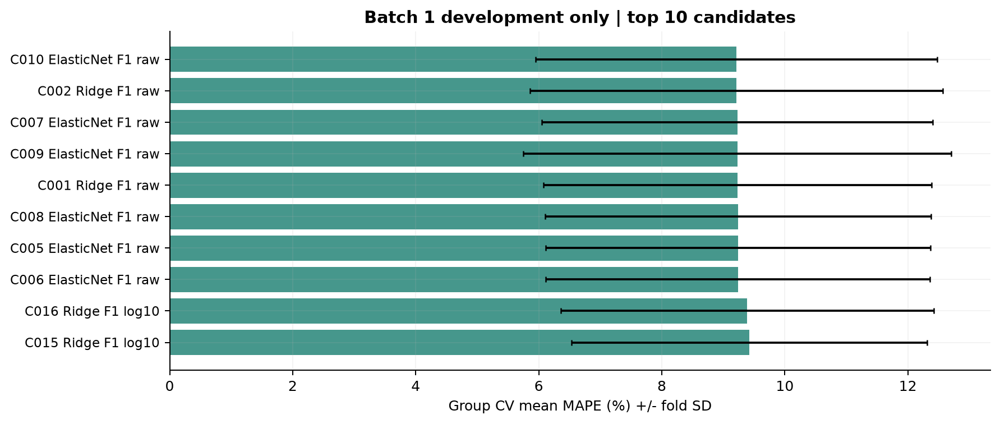
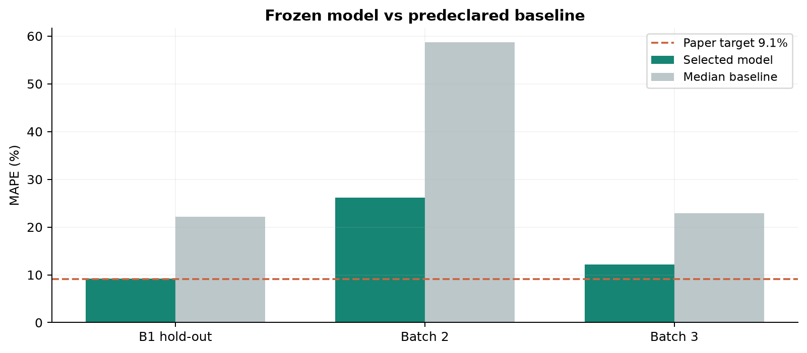
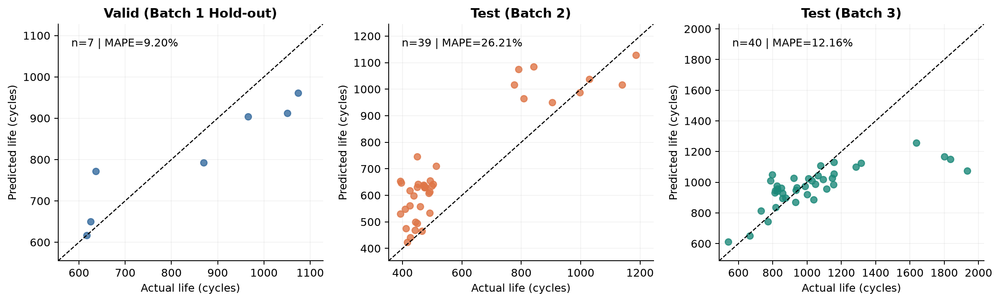
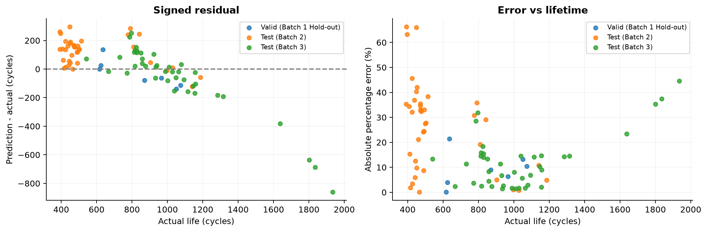

## ESS 배터리 수명 예측 | DAY 2

모델 개발 및 평가

SKALA 울산 3반 · U095 이연주 · 2026.10.02

| Batch 1 CV | Batch 1 Hold-out | Batch 2 Test | Batch 3 Test |
| --- | --- | --- | --- |
| 9.21% | 9.20% | 26.21% | 12.16% |

핵심 결론: 단일 ΔQ 분산 피처의 규제 회귀가 Batch 1 개발 CV에서 선택되었다. CV 9.21%와 hold-out 9.20%는 비슷했지만, Batch 2 MAPE는 26.21%로 논문 기준 9.1%보다 17.11%p 높다. 특히 학습에 없던 단수명 셀을 높게 예측하는 경향이 나타났다. Batch 3 MAPE는 12.16%로 더 낮았지만, 1,000사이클 이상 장수명 셀에서는 과소예측이 남았다. 따라서 내부 검증의 안정성만으로 외부 배치 일반화를 판단할 수 없으며, 단수명·새 정책 데이터를 포함한 추가 학습과 독립 검증이 필요하다.

## 01. 데이터 범위와 사전 품질 기준

| 구분 | 실제 파일 날짜 | 원본 | 유효 정답 | 최종 평가/학습 |
| --- | --- | --- | --- | --- |
| Batch 1 | 2017-05-12 | 46 | 46 | 36 |
| Batch 2 | 2018-02-20 | 47 | 39 | 39 |
| Batch 3 | 2018-04-12 | 46 | 44 | 40 |

DAY 1의 주분석 115셀과 분할을 그대로 재사용했다. 모델 개발 결과를 보고 배제 대상을 바꾸지 않았다. 원본 MAT 파일은 수정하지 않았다.

| 대상 | 제외·보류 사유 | 처리 원칙 |
| --- | --- | --- |
| B1: b1c0~4 | 계속 실험된 셀이나 이번 제공 파일에 연결 가능한 후속 배치가 없음 | 수명 라벨을 임의 연결하지 않음 |
| B1: b1c8,10,12,13,22 | 종료 미확인 | 완전 관측 수명 회귀에서 보류 |
| B2: b2c22,23,35~40 | 수명 NaN 및 특수 프로토콜 | 정답을 대치하지 않음 |
| B3: b3c2,23,32,37,42,43 | 저자 공개 코드 품질 경고 채널; 23,32는 정답도 NaN | 사전 품질 필터 유지 |

비교 범위: 원논문 124셀 실험과 이번 파일·표본 구성은 다르다. 특히 제공 Batch 2 날짜는 2018-02-20으로 논문 공개 코드의 2017-06-30과 다르다. 9.1%는 과제 기준이며, 동일 조건 재현 성능으로 표현하지 않는다. [1]

## 02. DAY 1 관찰과 모델링 구현

| DAY 1 근거 | DAY 2 구현 | 판단 논리 |
| --- | --- | --- |
| log10 Var(ΔQ)와 수명의 음의 관계가 세 배치에서 일관됨 | F1: log_dq_var 단독 | 소표본에서 핵심 신호부터 검증 |
| 초기 Qd 감소와 충전 조건의 추가 정보 가능성 | F2: F1 + qd_slope + c_equiv | 열화 추세·조건이 추가 설명력을 주는지 비교 |
| 온도·저항은 보조 신호이며 배치 효과 가능성 | F3: F2 + tavg_median + ir_median | 추가 변수의 효용은 개발 CV로 판단 |
| ΔQ 통계량 간 중복·소표본 문제 | Ridge, ElasticNet / 얕은 Random Forest | 규제 선형 모델 중심, 비선형 비교군 |
| Batch 1에는 500 미만 단수명 클래스가 없음 | Cycle Life 연속값 회귀 선택 | 분류의 단일 클래스 학습 문제 회피 |

ΔQ = Qdlin(100)-Qdlin(10), log_dq_var = log10(sample variance, ddof=1)다. qd_slope는 사이클 2~100의 유효 Qd 선형 기울기다. 온도·저항은 같은 초기 구간의 양수 관측 중앙값이다. c_equiv = 0.8 / [p/C1 + (0.8-p)/C2]이며 p는 1단계 충전 전환 SOC 비율이다.

선별 원칙: knee, 마지막 용량, 전체 기록 길이, 후기 열화 기울기, 수명 정답은 입력으로 쓰지 않았다. ID와 배치는 식별·평가용이고 정책 문자열은 그룹 분리용이다. 타깃 원값과 log10 변환도 CV에서 비교했다.

## 03. 정책 그룹 분리와 전처리 누수 방지

| 단계 | 데이터 | 사용 목적 |
| --- | --- | --- |
| 개발 학습 | Batch 1의 29셀 / 16개 정책 | 고정 GroupKFold 4-fold로 후보 비교 |
| Hold-out | Batch 1의 7셀 / 4개 정책 | 선택 완료 뒤 내부 일반화 확인 |
| 최종 적합 | Batch 1의 36셀 | 선택한 동일 사양으로 재학습 |
| 최종 외부 평가 | Batch 2: 39셀 / Batch 3: 40셀 | 선택 모델과 사전 지정 중앙값 기준모델만 평가 |

DAY 1 planned_split.csv를 그대로 사용했다(random_state=42). 개발/hold-out 사이와 각 CV fold 사이의 동일 정책 중복은 0이다. 셀 무작위 분리만으로 같은 정책의 중복을 막을 수 없으므로 정책 그룹 분리를 적용했다. [2]

Pipeline은 중앙값 대치 → StandardScaler → 규제 회귀 순이다. 트리는 표준화를 생략한다. CV마다 전처리 통계가 해당 학습 fold에서만 계산되었는지 검사했다. 로그 타깃은 TransformedTargetRegressor로 역변환하며, 평가 지표는 원래 사이클 단위에서 계산했다. [3]

Hold-out은 7셀로 작다. 또한 Valid는 29셀 학습 모델, Test는 36셀 재학습 모델이므로 두 점수 차이는 배치 이동만의 효과가 아니다.

## 04. 개발 CV 모델 선택

선택: ElasticNet / F1 / raw 타깃, alpha=0.1, l1_ratio=0.8. 85개 사양 × 4-fold를 비교했으며 CV MAPE는 9.21% (fold SD 3.26%p)다.

탐색 범위: Ridge alpha 0.1/1/10/100; ElasticNet alpha 0.001/0.01/0.1 × l1_ratio 0.2/0.8; Random Forest depth 2/3 × leaf 3/5, 300 trees. 3개 피처 세트와 원값/로그 타깃을 조합하고 중앙값 기준모델 1개를 더했다.

해석: 선택된 ElasticNet의 CV MAPE는 9.21%이고, 차순위 Ridge는 9.21%다. 둘의 차이는 0.0026%p로 사실상 매우 작다. 즉 ElasticNet이 Ridge보다 확실히 뛰어나다고 말할 수는 없다. 이번 고정 후보 중 가장 낮은 값을 낸 사양을 선택했지만, 같은 29셀 개발 CV로 후보 탐색과 선택을 함께 했으므로 이 결과는 hold-out과 외부 Batch에서 다시 확인해야 한다.

## 05. 피처 추가와 모델 복잡도 비교

| 피처 세트 | 각 세트의 최선 사양 | CV MAPE | 판단 |
| --- | --- | --- | --- |
| F1 | ElasticNet / raw | 9.21% | 추가 피처 없이 최저 오차 |
| F2 | ElasticNet / log10 | 9.89% | 이번 분할에서는 F1보다 높은 오차 |
| F3 | ElasticNet / log10 | 9.89% | 이번 분할에서는 F1보다 높은 오차 |

| 모델 계열 | 최선 피처 / 타깃 | CV MAPE | fold SD |
| --- | --- | --- | --- |
| Dummy | F1 / raw | 15.06% | 5.42%p |
| Ridge | F1 / raw | 9.21% | 3.36%p |
| ElasticNet | F1 / raw | 9.21% | 3.26%p |
| RandomForest | F1 / log10 | 10.04% | 3.66%p |

피처를 많이 넣는 것이 항상 낫지는 않았다. 조건·온도·저항의 추가 정보가 이번 소표본 정책 분할에서 일반화 오차를 줄이지 못했다. 이 결과는 해당 변수의 물리적 중요성이 없다는 뜻이 아니라 현재 표본·피처 정의·후보 범위에서의 결과다.

모델 해석: 선택 모델의 입력은 log_dq_var 하나다. 이 값을 Batch 1 학습 자료의 평균 0, 표준편차 1 기준으로 바꾼 뒤 ElasticNet이 계수 -118.74를 학습했다. 따라서 ΔQ 분산 신호가 학습 표준편차 1만큼 커질수록 예측 수명은 평균적으로 약 119사이클 낮아진다. 음수 부호는 DAY 1에서 관찰한 “초기 ΔQ 변화가 클수록 수명이 짧은 경향”과 같은 방향이다. 다만 한 셀의 실제 수명을 확정하거나 ΔQ가 수명을 직접 감소시킨다는 인과 결론은 아니다.

## 06. 필수 성능 보고

| 구분 | MAPE / Gap | 비고 |
| --- | --- | --- |
| Train (Batch 1 CV) | 9.21% | 29셀, 정책 그룹 4-fold 평균; SD 3.26%p |
| Valid (Batch 1 Hold-out) | 9.20% | 29셀 학습 모델; 미사용 정책 7셀 평가 |
| Test (Batch 2) | 26.21% | Batch 1 전체 36셀 재학습; Batch 2 39셀 |
| Gap (Train-Valid) | -0.01%p | Valid - CV; (+)이면 과적합 또는 분할 난도 차이 의심 |
| Gap (Valid-Test) | 17.01%p | Batch 2 - Valid; (+)이면 일반화 저하 의심 |
| Gap (Target-Test) | 17.11%p | Batch 2 - 9.1; (+)이면 논문 기준보다 높은 오차 |

Gap은 “양수일수록 오차 증가”에 맞춰 Valid-CV, Test-Valid, Test-9.1로 계산했다. %와 %p는 다른 단위다. Train은 학습 재대입 오차가 아닌 개발용 29셀의 4개 검증 fold MAPE 평균이다.

핵심 해석: CV 9.21%와 hold-out 9.20%의 차이는 -0.01%p다. 둘 다 Batch 1 안에서 정책 그룹을 나누어 평가한 결과이므로, 이 차이가 작다는 것은 이번 내부 분리에서 성능이 크게 흔들리지 않았다는 뜻이다. 그러나 hold-out은 7셀뿐이고 학습 모델도 CV와 완전히 같지 않으므로 과적합이 없다는 증거는 아니다. 반면 Batch 2 오차는 hold-out보다 17.01%p 높다. 내부 정책 분리 성능만으로는 새로운 수명 분포·측정 시기의 외부 Batch를 충분히 예측하지 못했다.

논문 기준 대비: Batch 2 Gap은 +17.11%p다. 기준 미달을 그대로 보고하며 외부 점수를 낮추기 위한 재선택·이상치 삭제는 하지 않았다. 논문과 파일, 학습 규모, 분할, 피처 구성이 다르므로 격차 전체를 알고리즘 차이로 돌릴 수 없다. [1]

## 07. 기준모델과 보조 지표

| 평가 | MAE (cycles) | RMSE (cycles) | R² | 중앙값 MAPE |
| --- | --- | --- | --- | --- |
| Hold-out | 78.84 | 93.28 | 0.76 | 22.14% |
| Batch 2 | 131.80 | 154.52 | 0.50 | 58.73% |
| Batch 3 | 144.19 | 234.50 | 0.41 | 22.90% |

선택 모델은 세 평가셋 모두 중앙값 기준모델보다 낮은 MAPE를 보였다. 그러나 Batch 2 26.21%는 기준모델 개선과 별개로 과제 목표 9.1%를 달성하지 못한 결과다. Batch 3는 MAPE가 낮지만 RMSE가 더 크다. 긴 수명의 큰 절대 오차가 MAPE에서 상대적으로 작게 반영될 수 있다.

## 08. Batch 2 단수명 과대예측

Batch 1 학습 수명 범위는 534~1,074사이클이다. Batch 2에서는 500 미만 28셀의 MAPE가 29.24%, 평균 잔차(예측-실제)가 +129.88사이클이다. 학습에서 보지 못한 단수명 영역의 수명을 높게 예측하는 경향이다.

예: b2c6은 실제 393사이클인데 653.50으로 예측했다(APE 66.28%). 이 셀은 오류 분석에 남겼으며 제거하지 않았다. 초기 열화 지표의 관계가 배치마다 동일한 절편·기울기로 유지된다고 가정한 단순 회귀의 한계가 드러난다.

시사점: 단수명 조건을 포함한 추가 학습 데이터를 확보하는 것이 우선이다. 운용 시 수명 과대예측은 교체 시점을 늦출 위험이 있으므로 평균 MAPE만으로 안전한 사용 가능성을 판단할 수 없다. 신규 독립 데이터에서 보수적 예측 구간과 별도 안전 기준을 검증해야 한다.

## 09. Batch 3 추가 검증과 외삽 위험

| 구분 |  | MAPE (%) | 비고 |
| --- | --- | --- | --- |
| Train (Batch 1 CV) |  | 9.21% | 개발용 29셀의 4-fold 평균 |
| Valid (Batch 1 Hold-out) |  | 9.20% | 미사용 정책 7셀 평가 |
| Test (Batch 2) |  | 26.21% | 동일 최종 모델, 39셀 |
|  | Gap (Train-Valid) | -0.01%p | (+) : 과적합 의심 |
|  | Gap (Valid-Test) | +17.01%p | (+) : 배치 간 일반화 저하 의심 |
|  | Gap (Target-Test) | +17.11%p | Target : 원논문 9.1% |
| Test (Batch 3) |  | 12.16% | 동일 최종 모델, 40셀 |
|  | Gap (Batch2-Batch3) | +14.05%p | Batch 2 - Batch 3; Test 성능 비교 |
|  | Gap (Target-Test) | +3.06%p | Batch 3 기준, 원논문 성능 비교 |

이번 결과에서는 Batch 3의 MAPE가 Batch 2보다 낮았다. “배치가 다르면 반드시 오차가 더 크다”는 결론은 성립하지 않는다. 수명 분포와 상대오차의 분모가 달라지므로 MAPE와 절대오차를 함께 해석해야 한다.

Batch 3의 1,000 이상 19셀은 평균 잔차 -203.70사이클이다. b3c38은 실제 1,935인데 1,073.48로 예측했다(APE 44.52%, 잔차 -861.52). 학습 범위를 넘는 장수명 영역에서는 과소예측 위험이 남는다.

전압 정합성: 원본 139셀의 Vdlin은 같은 1,000점/2.0~3.5 V 격자다. Q100-Q10을 셀 내부에서 계산하고 상수 이동에 불변인 분산을 사용했다. 이것은 단순 Qdlin 값 비교의 위험을 줄이지만 전압별 비균일 오프셋이나 모든 배치 효과를 제거했다는 증거는 아니다.

## 10. 입력 분포 이동과 오차 방향

| 핵심 입력 log_dq_var | Batch 1 범위 밖 비율 | 평균 이동 / B1 표준편차 |
| --- | --- | --- |
| Batch 1 | 0.00% | 0.00 |
| Batch 2 | 43.59% | 0.84 |
| Batch 3 | 42.50% | -1.54 |

선택 입력이 Batch 1 범위를 벗어나는 셀은 Batch 2에서 43.59%, Batch 3에서 42.50%다. 두 배치의 이동 방향도 반대다. 입력 분포 이동과 수명 외삽이 함께 관찰되지만, 이것만으로 잔차의 원인을 확정하거나 sensor drift와 열화 조건 차이를 분리할 수는 없다.

향후 모니터링: log_dq_var 분포·범위 이탈률, 결측/측정축 정합성, 정책 구성 변화를 입력 drift 지표로 확인한다. 실제 수명 라벨이 도착하면 배치·정책·수명 구간별 MAPE와 잔차 방향을 추적한다. 현재 실험에서는 운영 drift를 실제 관측한 것이 아니라 배치 차이를 진단한 것이다.

## 11. 불확실성·한계·개선 우선순위

| 평가 | 정책 수 | 탐색적 95% MAPE 구간 |
| --- | --- | --- |
| Valid (Batch 1 Hold-out) | 4 | 3.96~13.58% |
| Test (Batch 2) | 12 | 18.25~34.36% |
| Test (Batch 3) | 8 | 8.18~16.52% |

정책 그룹을 복원추출한 1,000회 bootstrap이다(random_state=42). 고정 모델의 평가 표본 불확실성을 보여줄 뿐 학습·모델 선택 불확실성을 포함하지 않는다. 정책이 4개뿐인 hold-out 구간은 특히 불안정하다.

| 한계 | 근거 | 다음 단계 |
| --- | --- | --- |
| 소표본과 선택 낙관성 | 개발 29셀, 같은 CV로 85개 후보 선택 | 더 큰 독립 표본과 정책 그룹 nested CV |
| 외부 일반화 부족 | Batch 2의 단수명 과대예측 | 단수명/새 정책 학습 데이터 확보 |
| 실험 배치·측정 차이 | 입력 범위 이탈, 파일 날짜 차이 | 측정 정합성 감사와 독립 배치 재검증 |
| 운용 적용 근거 부족 | 실험실 단일 화학계, 전체 수명 예측 | 실제 ESS Live Test와 예측 구간 검증 |

최종 판단: DAY 1 전략은 재현 가능한 파이프라인으로 구현되었다. 내부 성능은 양호하나 Batch 2 목표를 달성하지 못했다. 기존 테스트를 보며 후속 튜닝할 경우 해당 데이터는 더 이상 독립 테스트가 아니므로 새 평가셋이 필요하다.

## 12. 재현 절차와 제출물

| 산출물 | 경로 / 역할 |
| --- | --- |
| 실행 노트북 | notebooks/03_day2_modeling.ipynb - 8개 코드 셀 실행 결과 포함 |
| 모델 구현 | src/day2_modeling.py - 고정 후보·CV·평가·진단 |
| 필수 성능표 | results/day2/tables/model_performance.csv |
| 추가 평가·원시 결과 | model_performance_extended.csv / predictions.csv / cv_fold_scores.csv |
| 저장 모델 | results/day2/models/final_model.joblib / holdout_model.joblib |

재실행: 프로젝트 루트에서 pip install -r requirements.txt → Jupyter에서 01_data_check.ipynb, 02_day1_eda.ipynb, 03_day2_modeling.ipynb를 순서대로 실행한다. 원본 MAT 파일 3개를 data/에 둔다. 모델 파일은 신뢰할 수 있는 파일만 로드한다.

[1] Severson et al., Nature Energy 4, 383-391 (2019), Data-driven prediction of battery cycle life before capacity degradation. https://web.mit.edu/braatzgroup/Severson_NatureEnergy_2019.pdf [2] scikit-learn GroupKFold: https://scikit-learn.org/stable/modules/generated/sklearn.model_selection.GroupKFold.html [3] scikit-learn TransformedTargetRegressor: https://scikit-learn.org/stable/modules/generated/sklearn.compose.TransformedTargetRegressor.html